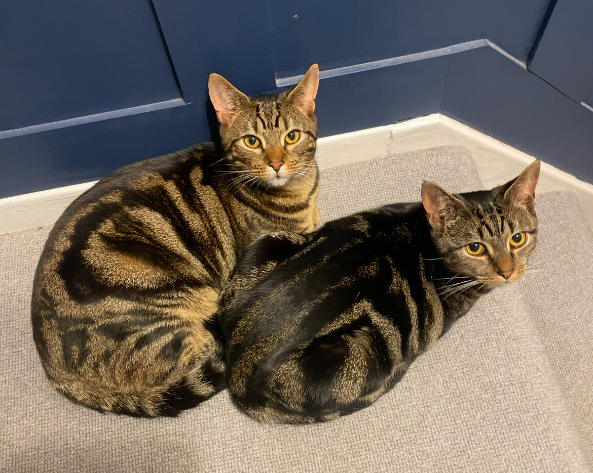
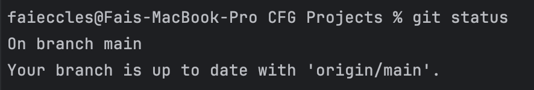
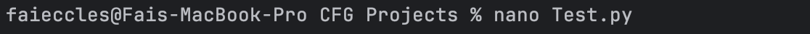
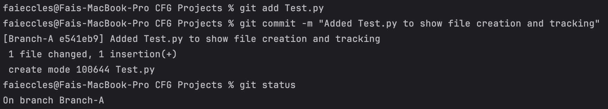
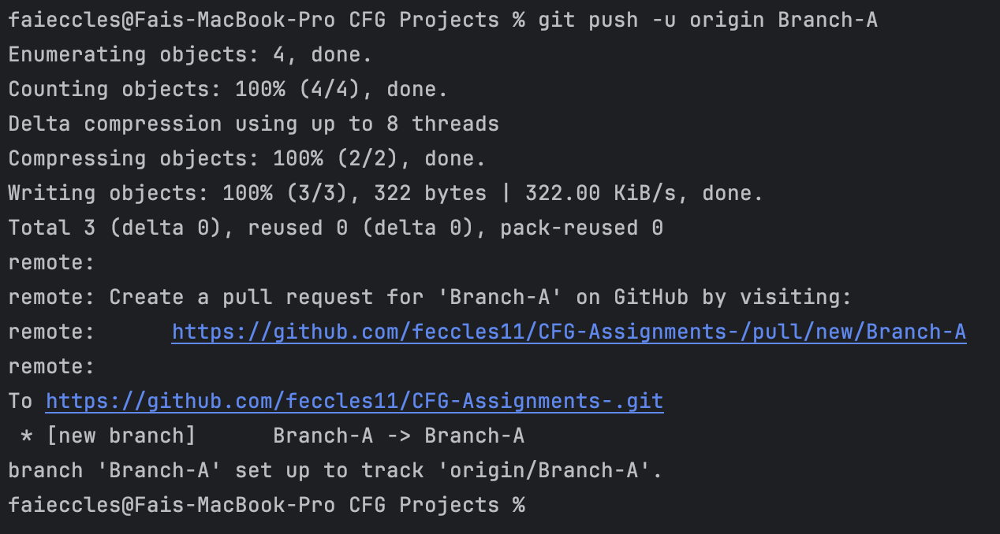
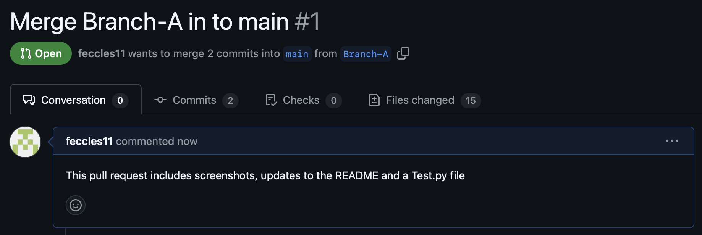
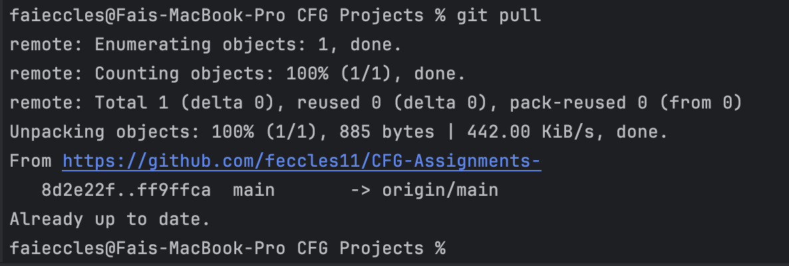
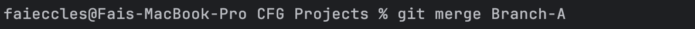
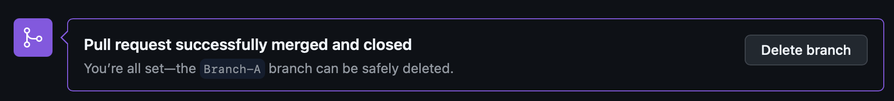
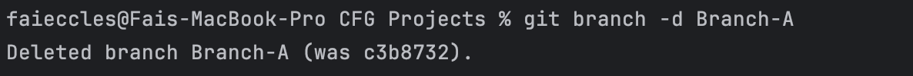

# CFG-Assignments
## About Me 
My name is *Faith Eccles* and I am ~~a French teacher~~ ready to start a career in tech. I am 28 years old and I have two cats called *Bob* and *Frank*.

Pictured left to right: Frank and Bob

## Purpose 
This document will outline the following:
- How I intend to use **GitHub** moving forward. 
- Define the purpose of **.gitignore** and **requirements.txt**.
- Show evidence of various Git commands and processes.

## GitHub & Me 
Github is a valuable tool for version control, enabling users to collaborate effectively and manage code efficiently. 

I will use this repository for my CFGDegree Foundation Module Assignments. 

## .gitignore 
Used to specify files and directories that should be ignored when tracking changes. This is commonly used to shield sensitive data. 

## .requirements.txt
Used to outline any dependencies, allowing collaborators to identify libraries or packages needed in order to work on the project. 

## GitHub Commands
Below is the evidence of using essential Git commands throughout this project.

### Check Status

The command `git status` is used to assess the current status of the working directory. 

### Creating a Branch

To create a new branch, use `git checkout -b` followed by the branch name in order to create and immediately switch to that branch. 
Branches play an invaluable role in collaborative version control. 

### Creating Files

Files can be created using the `nano` command.

### Commit

The `git add` command is used to select the changes for the following `git commit` action. 

### Push

Changes can then be shared to the remote repository using `git push`. 

### Pull 
GitHub Pull Request:

A pull request can then be generated on GitHub in preparation for any branch merges. 

Local Pull:

An up to date version of the project can then be pulled to the local repository. 

### Merge

Make sure to merge remote and local repositories where necessary. 

### Delete Branch 
When you're finished working on a branch, it's good practice to delete it. There are two ways to delete a branch. 

This can be done on GitHub:

Or in the terminal: 

